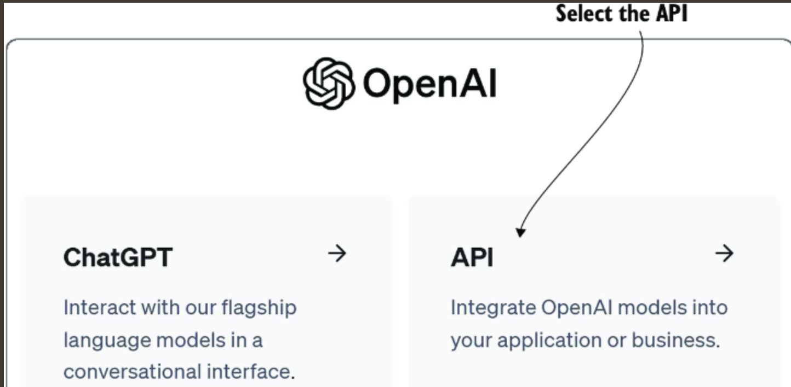
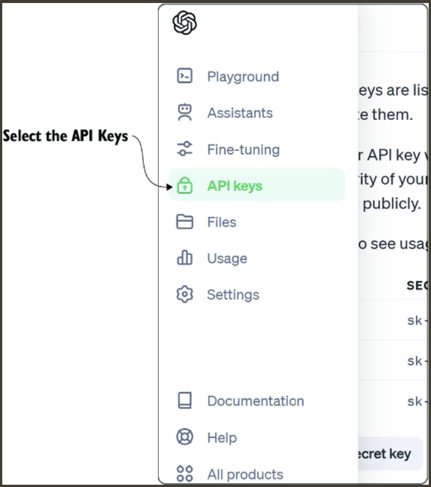
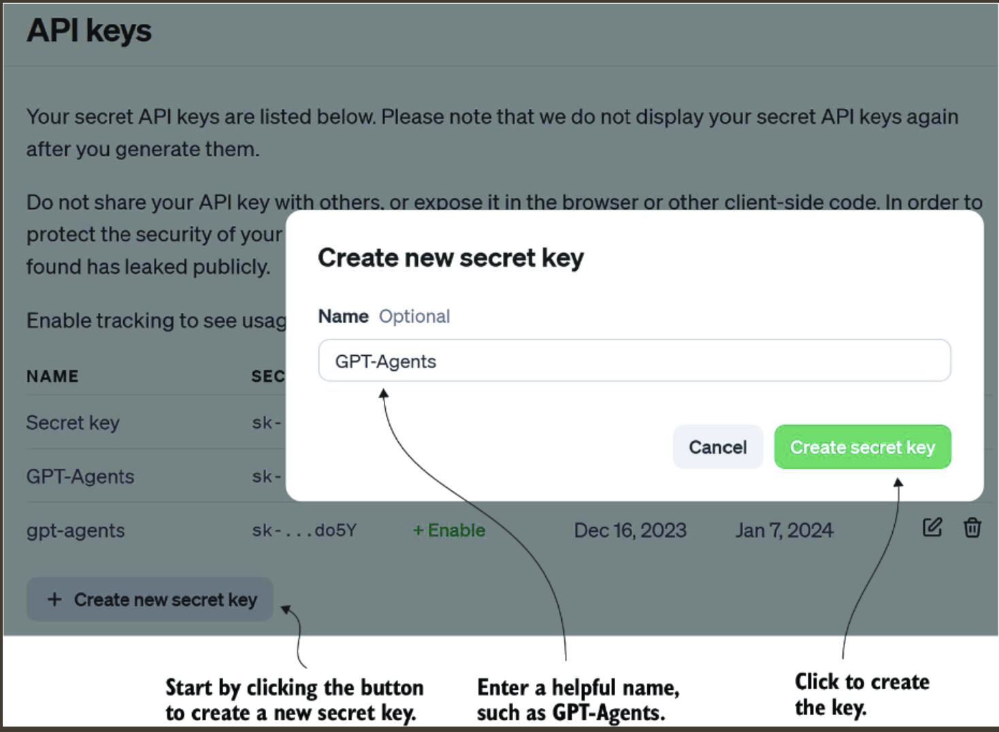
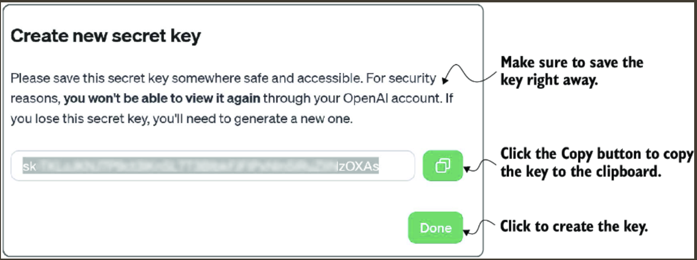
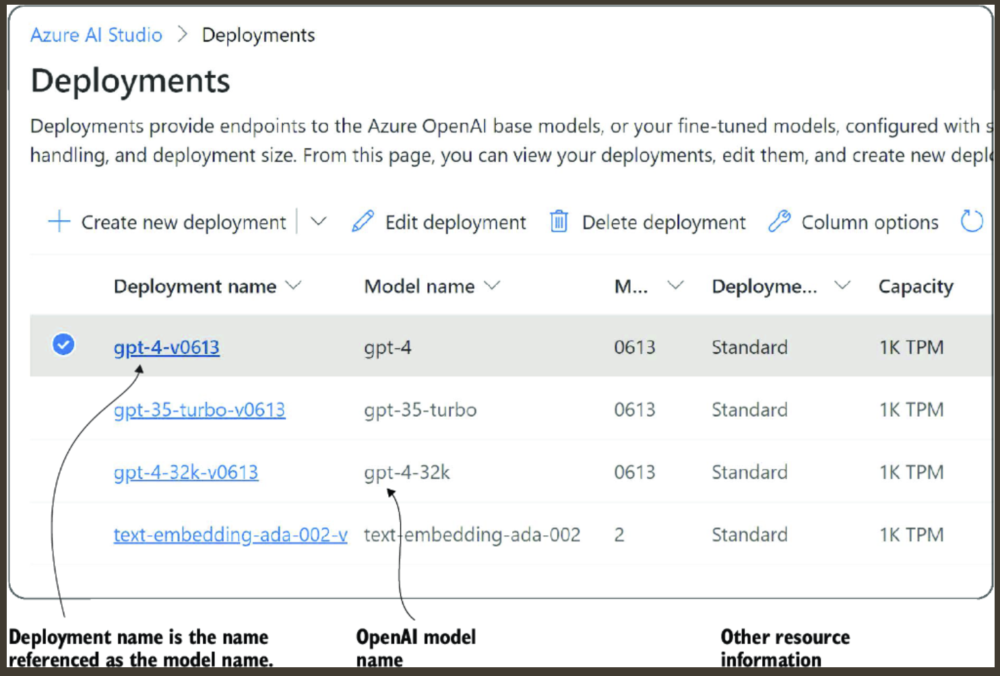
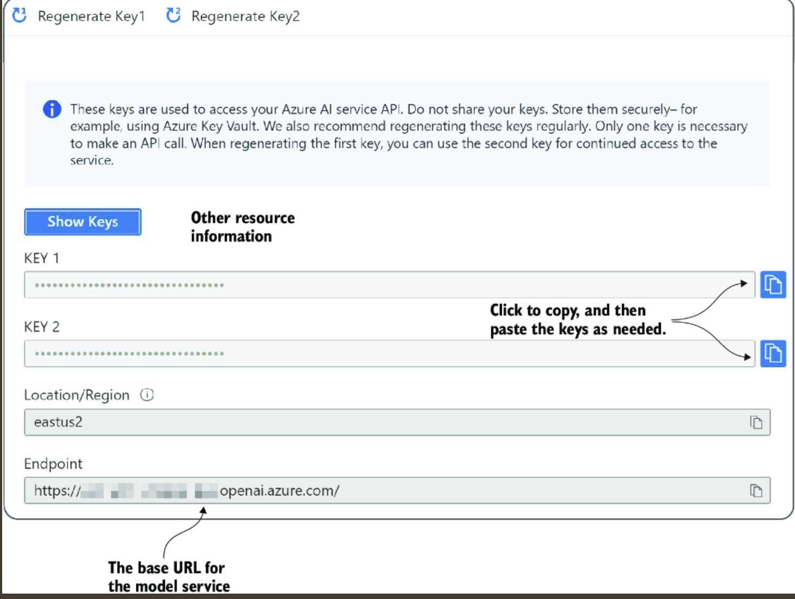

## A. Accessing OpenAI large language models
### A.1 Accessing OpenAI accounts and keys
1. Go to https://openai.com and log in, or register for an account and log in. If this is your first time creating an account, you’ll likely be given free credit in some amount. If you already have an account, you must register a payment method and type. It’s generally better to purchase a number of credits at a time. This will allow you to manage the costs better and avoid overruns.

2. After logging in to the platform, select ChatGPT or the API. Choose the API.

3. Open the left menu, and select the API Keys option

4. Click the Create button to create a new key, enter a name for the key, and click the Create Secret Key button

5. Copy and paste the key to a notepad or another area for safekeeping using the Copy button. Keep this key secret, and ensure it remains only on your development machine.

After generating a key, you can continue to use it within an `.env` configuration file or through other means of registering an OpenAI key. Other services, such as Azure OpenAI, will require the configuration of a model deployment and a base URL.

---
### A.2 Azure OpenAI Studio, keys, and deployments
Through its ongoing relationship with OpenAI, Microsoft hosts the same models at the same price within Azure OpenAI Studio. Occasionally, Azure may be a model version behind, but Microsoft generally keeps current with the latest OpenAI models.

These guidelines will be more general because there are several ways to access Azure and methods of creating accounts and accessing the studio (for specific instructions, refer to Microsoft documentation):
1. Log in to your Azure portal account subscription. 
2. Create a new Azure OpenAI Studio resource in a region that makes sense to you. At the time of writing, not all regions provided access to all models. You may need to check which models are available for your region first. This will also be specific to your account and usage. 

Within Azure OpenAI, models are exposed through a resource allocation called a deployment. Deployments wrap a model, such as GPT-4, and provide access to the resource.

3.  Click the Create New Deployment button to create a new deployment, and then select the model you want to deploy. 
4.  After the model is wrapped in a deployment, you must access the parent Azure OpenAI resource. From there, you can access the key, end point, or base URL needed to configure your connection.

The three critical differences to remember when connecting to a resource such as Azure OpenAI Studio or another LLM using the OpenAI tooling are listed here:
- The api key to access the model 
- The base url or endpoint where the model is located 
- The name of the model or deployment name

---