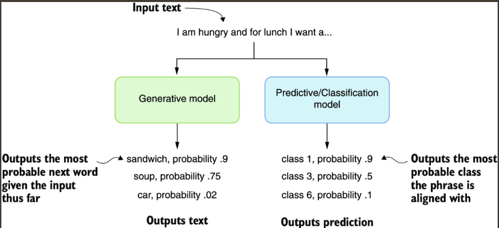
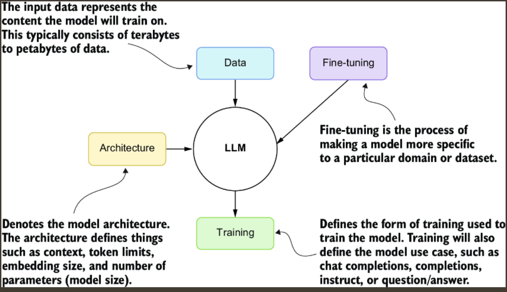

This chapter covers
- Understanding the basics of LLMs
- Connecting to and consuming the OpenAI API
- Exploring and using open source LLMs with LM Studio
- Prompting LLMs with prompt engineering
- Choosing the optimal LLM for your specific needs

---
LLMs and GPTs are generative models, which means they are trained to generate rather than predict or classify content.

> The difference between generative and predictive/classification models. Generative models create something from the input, whereas predictive and classifying models classify it.

---
We can further define an LLM by its constituent parts. In this diagram, data represents the content used to train the model, and architecture is an attribute of the model itself, such as the number of parameters or size of the model. Models are further trained specifically to the desired use case, including chat, completions, or instruction. Finally, fine-tuning is a feature added to models that refines the input data and model training to better match a particular use case or domain.

> The main elements that describe an LLM

---
The transformer architecture of GPTs, which is a specific architecture of LLMs, allows the models to be scaled to billions of parameters in size. This requires these large models to be trained on terabytes of documents to build a foundation. From there, these models will be successively trained using various methods for the desired use case of the model.

ChatGPT, for example, is trained effectively on the public internet and then fine-tuned using several training strategies. The final fine-tuning training is completed using an advanced form called `reinforcement learning with human feedback (RLHF)`. This produces a model use case called chat completions.

`Chat completions` LLMs are designed to improve through iteration and refinement—in other words, chatting. These models have also been benchmarked to be the best in task completion, reasoning, and planning, which makes them ideal for building agents and assistants. Completion models are trained/designed only to provide generated content on input text, so they don’t benefit from iteration.